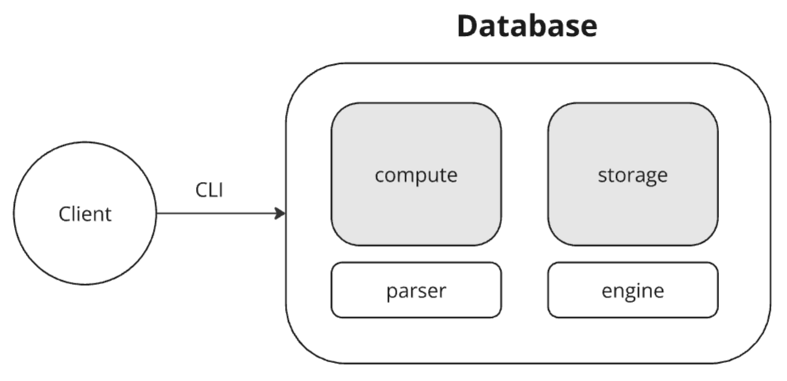

# go-fast-key
FastKey is in-memory key-value database with support for asynchronous replication (physic) and WAL (Write-Ahead Logging).

## System design



The main components of architecture:

1. **compute** - handling client requests

    - *parser* - client requests parsing

2. **storage** - data processing

    - *engine* - data storage

The request processing process is a series of steps. First, the request is received by the compute layer, where it is analyzed and parsed. Then, the command from the request is sent to the storage layer to manage the data.

## Query language

The grammar of the query language in the form of eBNF:

```eBNF
query = set_command | get_command | del_command

set_command = "SET" argument argument
get_command = "GET" argument
del_command = "DEL" argument
argument    = punctuation | letter | digit { punctuation | letter | digit }

punctuation = "*" | "/" | "_" | ...
letter      = "a" | ... | "z" | "A" | ... | "Z"
digit       = "0" | ... | "9"
```

There are only three possible commands (SET, GET, and DEL), and the arguments for these commands are limited to the following combinations: /(\\w+)/g, with delimiters being any whitespace characters.

Query examples:

```eBNF
SET weather_2_pm cold_moscow_weather
GET /etc/nginx/config
DEL user_\*\*\*\*
```